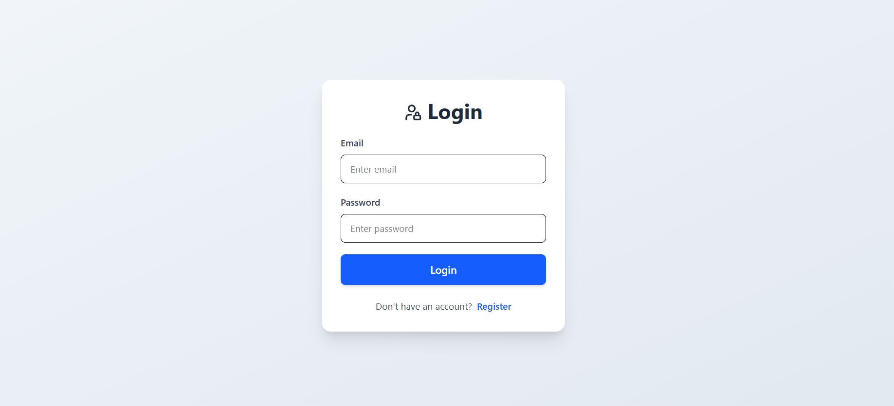
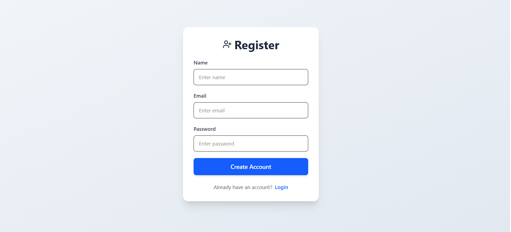
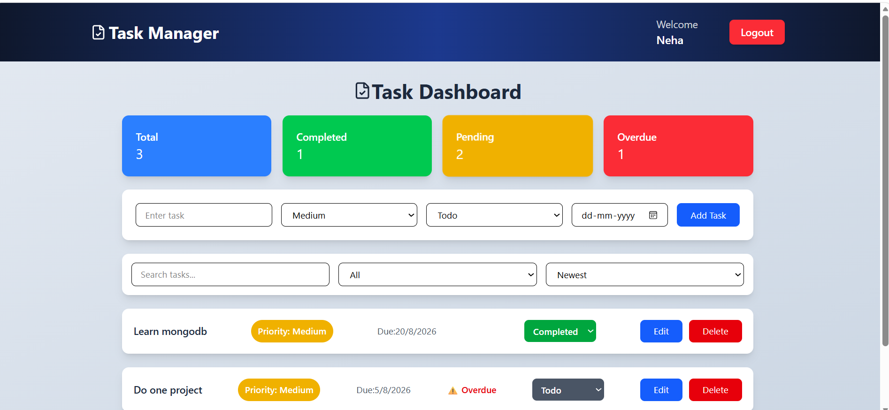

# Task Management App

A full-stack task management application where users can create, update, delete, and manage their personal tasks.

## Features

- User registration and login
- JWT authentication
- Protected dashboard
- Create, edit, update, and delete tasks
- Task status management
- Search tasks
- Filter tasks by status
- Sort tasks by date and priority
- Due date and overdue task tracking
- Responsive user interface

## Tech Stack

### Frontend
- React.js
- Vite
- Tailwind CSS
- React Router
- Axios

### Backend
- Node.js
- Express.js
- MongoDB
- JWT Authentication

## Project Structure

```
task-management/
│
├── my-app/     # React application
│
└── backend/      # Express API
```

## Installation

### Backend Setup

```bash
cd backend
npm install
```


Run backend:

```bash
npm start
```

### Frontend Setup

```bash
cd my-app
npm install
npm run dev
```

## Screenshots

### Login Page


### Register Page


### Dashboard



## Author
Rajni